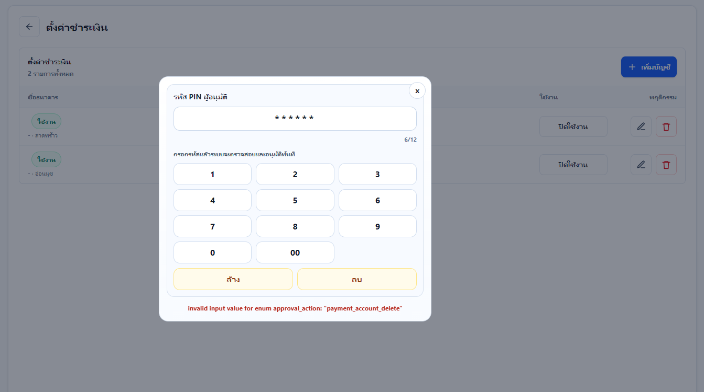

# POS Platform (Multi-tenant)

Production-oriented monorepo for a noodle shop and small restaurant POS platform.

## Stack
- Monorepo: pnpm workspaces + Turbo
- Web apps: Next.js 16 App Router + TypeScript
- Database/Auth: Supabase (PostgreSQL + RLS)
- Shared contracts: TypeScript packages for Android POS and web modules

## Deployment surface model

POS/Sales and IT Backoffice must run as separate Vercel Projects and separate domains. Do not expose IT Backoffice from the POS/Sales public URL.

- POS/Sales: Vercel Project example `sstipos-pos`, domain example `pos.<domain>`, `APP_SURFACE=pos`.
- IT Backoffice: Vercel Project example `sstipos-it-admin`, domain example `admin.<domain>` or `it.<domain>`, `APP_SURFACE=it_admin`.
- Local development only: `APP_SURFACE=all`.

Surface isolation is prepared in `apps/backoffice-web/src/proxy.ts` with optional host allowlists:
- `POS_ALLOWED_HOSTS=pos.<domain>`
- `IT_ADMIN_ALLOWED_HOSTS=admin.<domain>,it.<domain>`

Security must still be enforced server-side. The IT admin layout and `/api/it-admin/*` guards resolve authenticated platform roles server-side and allow only `it_admin` or `it_support`; POS APIs continue to resolve tenant, branch, device, session, permission, contract, and feature state server-side.

No Vercel deploy is performed by documentation or audit passes unless explicitly requested. Future production setup must configure separate environment variables and production aliases per Vercel Project.

## IT Backoffice roles

IT staff must use `/it-admin/login` on the IT Backoffice project/domain, not the POS store login.

| Role | Access |
|---|---|
| `it_admin` | Full IT Backoffice access, including feature flags, branch overrides, devices, customer display devices, platform users, and settings. |
| `it_support` | Limited support access: tenants, branches, package contract/subscription, user branch roles except delete/deactivate, active sessions, shifts, audit review, monitoring/readiness, and package quote/catalog. |
| `tenant_user` | No IT Backoffice access. |

The `platform_role` database enum includes `it_support` via `supabase/migrations/20260612132854_add_it_support_platform_role.sql`. Server-side IT API guards enforce the role/menu matrix; hiding navigation is not treated as authorization.

`/it-admin/login` now presents the first `SSTiPOS Support` UI pass for the separated IT Backoffice project/domain:
- split white/blue login card for desktop and stacked responsive layout for mobile/tablet
- email/password login tab backed by the existing server-side Supabase Auth + platform role check
- QR login tab placeholder only; QR auth is not implemented yet
- Thai/English loading, error, invalid-role, session-expired, signed-out, and success states
- preferred logo path: `apps/backoffice-web/public/brand/sstipos-support-logo.png`; if missing, the current UI uses `/brand/sst-ipos-logo.svg` as a safe fallback

No Vercel command or deployment was run for this UI pass.

## Repository structure

```text
pos-platform/
  - apps/
    - backoffice-web/    # Back Office + IT Admin + POS preview + Unified Store/POS login
    - pos-android/       # Placeholder docs + API contract reference
  - packages/
  - shared-types/        # Shared domain types and API payload contracts
  - pos-domain/          # Business rules and policy guards
  - ui/                  # Reusable UI primitives
  - supabase/
  - migrations/
  - seeds/
  - seed.sql
  - rls-policies.sql
```

## Business coverage included
- POS sales/orders/receipts
- Dine-in table flows and takeaway
- Manual delivery channels (Grab, LINE MAN, Shopee, Merchant App, Other)
- Cash and bank transfer payment models
- Product/ingredient/recipe/stock movement models
- Shift open/close with mismatch and unpaid bill guardrails
- Staff/manager/owner/it_admin/it_support role model
- Back office and IT admin UI routes
- Audit logging foundation
- Store + POS secure login flow (store -> branch -> employee -> device) now runs in `backoffice-web`
- IT Backoffice login is prepared separately at `/it-admin/login`; do not reuse POS store login for IT staff.

## Login / Pre-entry flow (updated)
- Scope: only login and pre-sales entry flow was changed. Existing POS Sales screen/UI is unchanged.
- Security model:
  - never trust client `tenant_id`, `branch_id`, `store_code`, `device_code`
  - server resolves scope from store code + signed opaque pre-entry context cookie
  - final POS session and handoff cookie are server-created only
  - service-role remains server-only
  - feature gates and tenant/branch scope checks remain enforced server-side

### Step routes
- `/login/store`: store code verification
- `/login/branches`: branch selection (auto-skip when single-branch mode is active)
- `/login/employee`: employee verification by employee code
- `/login/devices`: POS device/register selection

### API routes for login flow
- `POST /api/auth/store-code/verify`
- `GET /api/auth/branches`
- `POST /api/auth/branches/select`
- `POST /api/auth/employee/verify-code`
- `GET /api/auth/devices`
- `POST /api/auth/devices/select`
- `GET /api/auth/session/context`
- `DELETE /api/auth/session/context`

### Variant behavior
- Variant A (multi-branch owner):
  - user verifies store code, then selects branch, then verifies employee, then selects device, then enters POS.
- Variant B (single-branch/no branch-selection mode):
  - store verification auto-resolves branch and skips branch selection UI, then proceeds to employee verification and device selection.

### Device access rules before sales entry
- device status is resolved server-side from `branch_devices` and active `pos_sessions`
- public statuses: `ready`, `in_use`, `offline`, `disabled`
- in-use devices require `pos.device.override_in_use` permission to force entry

### Employee and permission rules before sales entry
- employee must be active and belong to resolved tenant+branch
- role is resolved from `user_branch_roles` (`owner|manager|staff`)
- pre-entry permission gate requires `pos.sales.access`

### Testing checklist for this flow
- store code validation success/failure
- branch selection shown only when needed
- employee code login success/failure
- device list/status/in-use override behavior
- successful handoff redirects to existing POS route
- shift gate still applies in POS APIs after login

## Important rule enforcement
Implemented in domain logic + SQL triggers:
- Staff cannot self-cancel bills
- Bill cancellation requires manager/owner PIN approval
- Stock adjustment requires manager/owner PIN approval
- Shift close with unpaid dine-in bills or cash mismatch requires manager/owner override
- Recipe-based stock deduction hook (`app.consume_ingredient`) with stock movements

## Setup

1. Install pnpm (once)
```bash
npm install -g pnpm
```

2. Install dependencies
```bash
pnpm install
```

3. Configure environment files
- Copy `apps/backoffice-web/.env.example` to `apps/backoffice-web/.env.local`
- Set strong value for `POS_SESSION_HANDOFF_SECRET` before any shared/staging deployment

4. Apply Supabase migrations
```bash
supabase db reset
# or
supabase db push
```

5. Seed demo data
```bash
psql "$SUPABASE_DB_URL" -f supabase/seed.sql
```

6. Run local POS preview (Back Office app)
```bash
pnpm dev
```

7. Open POS sales preview in browser
- `http://localhost:3000/preview/pos`

Optional shortcut command:
```bash
pnpm dev:pos
```
This prints the POS preview URL and starts `apps/backoffice-web`.

## Demo Store Bootstrap (recommended before UI test)
Use demo data so the unified login flow and POS preview can connect immediately:

1. Apply latest migrations
```bash
supabase db push
```

2. Seed demo tenant/branch/products/users
```bash
psql "$SUPABASE_DB_URL" -f supabase/seed.sql
```

3. Demo values for login flow
- Store code: `NDL-TH-001`
- Branch: `BKK-01` (auto-selected in single-branch demo mode)
- Demo device code (UI shortcut): `POS-DEMO-01`

4. Open login/POS preview
- Login: `http://localhost:3000/login/store`
- POS: `http://localhost:3000/preview/pos`

## Local troubleshooting (`/preview/pos`)
- Apply latest migrations (`supabase db push`) so `audit_logs` includes compatibility columns (e.g. `target_user_id`).
- Restart local dev server after migration changes.
- First request in `next dev` can be slow while routes compile. Re-test after the first compile before judging runtime speed.
- Verify:
  - `GET /api/pos/session/current` -> `401 missing_pos_session` or `200`
  - `GET /api/pos/shifts/current` -> safe non-500 response in normal flow
- If login reaches device selection but a POS terminal remains `in_use`, call logout/reset from the current browser session first. New logout/reset flow revokes the active `pos_sessions` row before clearing cookies.
- Auth API timeout is controlled by `AUTH_API_TIMEOUT_MS` in `apps/backoffice-web/.env.local` (default from `.env.example`: `8000` ms).
- `POST /api/pos/perf` is non-blocking by design; telemetry write failures should not block POS preview rendering.

## Key docs
- `docs/PROJECT-AUDIT-HANDOFF-2026-06-02.md` (latest project audit + development handoff)
- `docs/database-schema-plan.md`
- `docs/rls-policy-plan.md`
- `docs/api-route-design.md`
- `docs/ui-route-structure.md`
- `context.md` (authoritative GPT/Codex handoff context)
- `docs/pos-multi-owner-branch-architecture.md`
- `docs/POS-LOGIN-POS-BRIDGE-E2E-CHECKLIST.md`
- `docs/definition-of-done.md`
- `docs/manual-qa-checklist.md`
- `docs/production-readiness-checklist.md`
- `docs/go-live-evidence-checklist.md`
- `docs/ARCHIVE-QR-DECOMMISSION-2026-05-31.md` (legacy QR reference archive)

Note: docs marked as archived are historical reference only. Use the current `/login/store -> branch/employee -> devices -> /preview/pos` flow for new development.

## API contract handoff for Android
- `GET /api/contracts`
- Shared TS contracts in `packages/shared-types`

## Current implementation status
This scaffold is production-oriented in architecture and separation of concerns, with working route surfaces and enforceable schema constraints. Latest audit handoff: `docs/PROJECT-AUDIT-HANDOFF-2026-06-02.md`; latest system/UI stability update: `docs/system-stability-audit-2026-06-04.md`.

Before go-live, complete:
- Execute the manual QA checklist and attach signoff evidence
- Run staging backup/restore and rollback drills with recorded results
- Rotate all production secrets and verify alert/on-call routing
- Configure centralized rate limiter backend (`RATE_LIMIT_BACKEND=upstash|redis`) and verify auth fail-closed behavior
- Complete `docs/go-live-evidence-checklist.md` with evidence links

## POS Sales Summary

- Route: `/preview/pos/sales-summary`
- API: `GET /api/pos/sales-summary`
- Returned data: `summary`, `paymentMethods`, `shifts`, `cashiers`, `bestSellingProducts`, and `salesRows`.
- Filters: `dateFrom`, `dateTo`, `branchId`, `shiftId`, `cashierId`, `paymentMethod`, and `status`.
- Access rules: the API resolves tenant, branch, user, and role from the authenticated server/POS session. The client never supplies trusted `tenant_id`.
- Branch isolation: owner/IT admin can view active branches in the tenant; manager/accountant are limited to assigned branches; staff-style access is scoped to self if reports permission is ever granted.
- UI behavior: the page shows KPI cards, payment breakdown, shift summary, cashier performance, best-selling products, detailed sales rows, loading/error/empty states, and CSV export.
- Verification commands used for this module should include `npm run typecheck`, `npm run lint`, and `npm run build`.

## POS Responsive Landscape UI

- POS route scope: `/preview/pos/*`
- Viewport behavior: the POS layout exports route-level viewport settings with `width=device-width`, `initial-scale=1`, `maximum-scale=1`, `user-scalable=no`, and `viewport-fit=cover`.
- Orientation guard: `PosViewportGuard` blocks unsupported portrait or narrow POS usage and asks users to rotate to landscape. It shows Thai and English text and displays the current viewport size.
- Breakpoints:
  - `< 768px` or portrait: blocked/warning overlay for POS usage.
  - `768px-1023px` landscape: compact tablet/iPad layout, compact icon sidebar, tighter spacing, smaller product cards.
  - `1024px-1439px` landscape: laptop/small desktop layout with standard product grid and right cart panel.
  - `1440px+` landscape: expanded desktop layout with wider cart and 4-column product grid.
  - `1600px+` and `2200px+`: centered workspace with larger max-width and 5-6 product columns.
- App-ready CSS: POS shell uses `100dvh`, safe-area padding, `overscroll-behavior`, and `touch-action: manipulation` to reduce accidental zoom/double-tap behavior.
- Modal behavior: POS dialogs and drawers now have viewport-safe max-height, internal scrolling, safe-area padding, and sticky action zones where possible.
- Files changed for this layer: `app/preview/pos/layout.tsx`, `components/pos-preview/pos-viewport-guard.tsx`, `lib/viewport-hooks.ts`, `components/pos-preview/pos-shell-sidebar.tsx`, and `app/globals.css`.
- Target checklist: verify 1024x768, 1180x820, 1194x834, 1366x1024, 1280x720, 1366x768, 1440x900, 1536x864, 1600x900, 1920x1080, 2560x1440, plus portrait/narrow warning states.

## Development Guardrails / บันทึกกันพลาด (2026-06-05)

This section is the quick handoff for future development. It was added after a lightweight whole-project check of README/package scripts, app route groups, component folders, service modules, and timeout/error patterns.

### Current system map
- Main app: `apps/backoffice-web` using Next.js App Router.
- Route groups: `(backoffice)`, `(it-admin)`, `api`, `login`, and `preview`.
- Main component areas: `backoffice`, `it-admin`, `pos`, `pos-preview`, `pos-ui`, `pre-entry`, `pwa`, and `tables`.
- Main service layer: `activity-audit-service`, `approval-service`, `attendance-service`, `customer-display-policy-service`, `pos-sales-*`, `pos-settings-service`, `shift-close-service`, `stock-transaction-service`, `store-profile-service`, `subscription-package-service`, and `table-service`.
- Database/auth boundary: Supabase service-role access must stay server-only. Client code must not trust or submit authoritative `tenant_id`, `branch_id`, `store_code`, `device_code`, role, or permission state.

### Critical development rules
- Always resolve tenant, branch, user, role, permissions, and POS session on the server before reading or mutating business data.
- Keep business writes fast. Do not block UI/API success on audit logs, telemetry, policy sync, perf logs, or other best-effort background work unless the feature explicitly requires it.
- Add explicit timeouts for user-facing save/login/checkout flows. If a request can hang, the UI must restore buttons and show a clear Thai/English error.
- When changing Supabase schema, update migrations, seed data, service selectors, compatibility fallbacks, and README/docs together.
- After migration changes, restart `next dev`; the first request may compile slowly and should not be treated as runtime slowness.
- Avoid broad refactors in `pos-sales-service`, `pos-settings-service`, and API auth/session routes unless covered by typecheck plus targeted manual flow tests.
- Keep route/API contracts stable for Android handoff: shared payload shapes belong in `packages/shared-types` when reused externally.
- Preserve POS landscape behavior. Any POS UI edit should be checked at tablet landscape and laptop sizes, plus portrait warning state.

### Recent cashier device settings fix
- UI file: `apps/backoffice-web/src/components/pos-preview/pos-settings-workspace.tsx`.
- Service file: `apps/backoffice-web/src/lib/services/pos-settings-service.ts`.
- Cashier device add/edit now shows `กำลังบันทึก...` immediately and uses a 10-second client timeout so the popup cannot stay stuck forever.
- `saveDeviceSettings` returns after the `branch_devices` write succeeds. `syncBranchDevicePolicy` and `appendAuditLog` run as background best-effort tasks to prevent slow audit/policy writes from freezing the save popup.
- If this flow is edited again, verify duplicate device code, missing branch, inactive/maintenance status, edit existing device, and create new device.

### Minimum verification before handoff
- `cmd /c pnpm --filter backoffice-web exec tsc -p tsconfig.json --noEmit --pretty false`
- `cmd /c pnpm --filter backoffice-web exec eslint <changed-files>`
- For POS settings/device edits: open `/preview/pos/settings`, add/edit a cashier machine, confirm popup closes, list updates, and timeout/error state does not trap the user.
- For login/session edits: test `/login/store -> /login/branches -> /login/employee -> /login/devices -> /preview/pos`.
- For sales/payment edits: test order create, payment, receipt, shift guard, and relevant stock deduction behavior.

### Known risk areas to inspect first
- `audit_logs` schema compatibility can cause retry loops; keep audit writes non-blocking unless required.
- Auth and device selection already use timeout helpers; match that pattern for new pre-entry APIs.
- `tenant_payment_accounts` has schema fallback logic; payment setting changes must verify both current and fallback column sets.
- Rate limiting can fail closed when configured with an unavailable backend; verify env vars before blaming UI code.
- Menu scan/slip verification routes depend on external AI/OCR config; keep clear mock/fallback modes for local testing.

## POS Settings Handoff (2026-06-06)

Use this section as the current source of truth before changing the Payment Settings or Tax Settings submenus.

### Supabase migration status
- `supabase db push` completed successfully against linked project ref `deejlitaivfnsbwqdugy` on 2026-06-06.
- `supabase db push` completed successfully again on 2026-06-07 to apply payment account scope uniqueness.
- Applied migrations:
  - `202606050001_add_payment_account_delete_approval_action.sql`
  - `202606050002_payment_account_qr_modes.sql`
  - `202606050003_branch_devices_settings_perf.sql`
  - `202606050004_tax_settings.sql`
  - `202606060001_payment_account_active_scope_uniqueness.sql`
- Do not show a permanent "migration has not been applied" banner in Payment Settings. The required migrations are now applied.
- Never place Supabase access tokens, database passwords, service-role keys, or other secrets in README, source files, commits, screenshots, or client-side code.
- If migration access fails later, verify the linked project, CLI account permissions, and `SUPABASE_DB_PASSWORD` outside source control.

### Payment Settings behavior
- Main UI: `apps/backoffice-web/src/components/pos-preview/pos-settings-workspace.tsx`.
- API: `apps/backoffice-web/src/app/api/pos/settings/payment-accounts/route.ts`.
- Service: `apps/backoffice-web/src/lib/services/pos-settings-service.ts`.
- PostgreSQL table: `tenant_payment_accounts`.
- The database/API is the authoritative source when available.
- Browser `localStorage` is only a POS preview resilience fallback for schema/network/timeout failures. Do not treat it as production persistence and do not move this fallback into normal back-office production workflows.
- Opening Payment Settings loads any preview fallback immediately, then refreshes from the API without clearing a valid visible list when the API is temporarily unavailable.
- Create/edit save must:
  - show the `กำลังบันทึก...` popup clearly;
  - prevent duplicate submissions while saving;
  - use a bounded request timeout;
  - update the visible list immediately after success;
  - show the saved-success popup;
  - preserve the item in preview fallback storage if the API is temporarily unavailable.
- Delete and active/inactive changes must update both the visible list and preview fallback consistently.
- Do not disable the Add Account button merely because a stale initial snapshot reports that the payment schema is unavailable.
- Runtime QR selection rule: an active branch-specific payment account wins over an active tenant-wide/all-branches account. The tenant-wide account is only the fallback when the current branch has no active branch-specific account.
- Active duplicate guard: there can be only one active branch-specific payment account per `tenant_id + branch_id`, and only one active all-branches payment account per `tenant_id`. Migration `202606060001_payment_account_active_scope_uniqueness.sql` deactivates older duplicates and adds partial unique indexes.
- The duplicate-scope migration is applied to linked Supabase project ref `deejlitaivfnsbwqdugy`.

### Tax Settings behavior
- UI/API/service files:
  - `apps/backoffice-web/src/components/pos-preview/pos-settings-workspace.tsx`
  - `apps/backoffice-web/src/app/api/pos/settings/tax/route.ts`
  - `apps/backoffice-web/src/lib/services/pos-settings-service.ts`
- Migration: `supabase/migrations/202606050004_tax_settings.sql`.
- Tax settings are connected to the POS sales/payment summary through `tax_settings`, `tax_total`, and `tax_lines`.
- Preview calculation and sales calculation must follow the same rule: only active tax lines are calculated when the main tax switch is enabled.
- Enabling an individual tax line may enable the main tax switch automatically so the preview responds immediately.
- Tax save must show `กำลังบันทึก...`, enforce a timeout, update local state from the API response, and show a saved-success popup.

## POS Transfer Payment Modal Handoff (2026-06-06)

### What changed
- The bank-transfer payment popup now uses a compact QR-only layout.
- The modal shows only the title, close button, visually prominent amount, QR code, short scan helper text, any transfer error, and the `ยืนยันเงินโอน` confirm button.
- Slip upload, slip OCR/read button, reference input, transfer account detail cards, long helper text, internal cancel-bill action, and the old two-column layout were removed from the transfer modal UI.

### Files/routes/components affected
- POS sales route: `/preview/pos`.
- Modal component: `apps/backoffice-web/src/components/pos/pos-payment-modals.tsx`.
- Transfer labels and payment confirmation caller: `apps/backoffice-web/src/components/pos/pos-sales-module.tsx`.
- Styling: `apps/backoffice-web/src/app/globals.css`.
- Payment Settings source for QR/PromptPay remains `apps/backoffice-web/src/components/pos-preview/pos-settings-workspace.tsx` through the existing payment account state.

### UI behavior notes
- Amount label is `ยอดชำระ`; QR label is `สแกน QR เพื่อชำระเงิน`.
- The QR card is centered in a single-column modal and the confirm button remains clearly visible at the bottom.
- If no PromptPay phone or uploaded QR image is configured, the modal shows an error and disables confirmation until a QR source exists.

### Payment flow safety notes
- Payment calculation, order totals, QR generation, tenant/branch/session/shift guards, and payment API confirmation flow were not moved into the client.
- The modal continues to display `transferReviewOrder.total_amount`, which is prepared by the existing POS order/payment flow.
- Confirm still calls the existing transfer confirmation handler; it does not trust user-entered amount values and does not introduce a new client-side payment total.

### Responsive notes
- Desktop/tablet modal width is capped around 560px, with the QR card centered at about 468px max width and QR image up to 300px.
- Mobile uses `calc(100vw - 24px)`, scales the QR image down to about 252px, keeps the amount large without horizontal overflow, and makes the footer button full width.
- The modal avoids internal scrolling in normal viewports and only allows vertical scrolling when the viewport is very small.

### Required regression checks
- Payment Settings: add an account, leave the submenu, reopen it, and confirm the account remains visible.
- Payment Settings: edit, toggle active status, and delete an account; confirm no duplicate or disappearing rows.
- Payment Settings: confirm the saving popup appears and closes on both success and timeout/error paths.
- Tax Settings: use base amount 1,000; verify VAT 7% produces 1,070 and withholding 3% deducts 30 when enabled.
- POS Sales: reload settings, add an item, and verify the payment summary matches the saved tax configuration.
- POS Sales transfer: open `/preview/pos`, choose bank transfer, verify the QR-only modal at tablet landscape/desktop/mobile widths, and confirm payment still completes through the existing API flow.
- Run:
  - `cmd /c pnpm --filter backoffice-web exec tsc -p tsconfig.json --noEmit --pretty false`
  - `cmd /c pnpm --filter backoffice-web exec eslint <changed-files> --no-cache`

## POS Stability / Performance Handoff (2026-06-06)

### What changed
- Added a shared client-side bounded fetch helper at `apps/backoffice-web/src/lib/client-fetch.ts`.
- POS users, shift, payments, and orders modules now use request timeouts on key load/save/cancel/payment actions so buttons do not stay busy forever when an API request stalls.
- POS order create, direct pay, shift open/join, and POS user management no longer block the HTTP response on audit-log writes. The business write still completes before success is returned; audit logging is now fire-and-forget like other POS routes.
- Backoffice lint no longer runs as `eslint .`; it is scoped to source/config/test paths and uses `.eslintcache`.
- Generated/build/cache outputs are ignored in ESLint and git: `.next`, `.next-local`, `.open-next`, coverage, `.eslintcache`, logs, and `tsconfig.tsbuildinfo`.
- Windows dev startup defaults to webpack and validates the local Next cache junction target before using `.next-local`; if the cache target is not writable, dev falls back instead of hanging on a bad cache path.

### Files/routes/components affected
- Client fetch helper: `apps/backoffice-web/src/lib/client-fetch.ts`.
- POS UI modules: `pos-users-module.tsx`, `pos-shift-module.tsx`, `pos-payments-module.tsx`, `pos-orders-module.tsx`.
- POS API routes: `api/pos/orders`, `api/pos/orders/[orderId]/pay`, `api/pos/shifts/open`, `api/pos/shifts/join`, `api/pos/users`.
- Tooling/config: `apps/backoffice-web/package.json`, `eslint.config.mjs`, `.gitignore`, `scripts/dev-safe.mjs`, `scripts/setup-local-next-cache.mjs`.

### Behavior notes
- Timeout failures now surface through the existing error state instead of leaving loading/busy states stuck.
- Payment/order/shift calculation and write logic was not moved or trusted from the client.
- Audit log failures should not slow cashier-facing responses, but they may be recorded slightly after the API response.
- `api/pos/perf` still awaits audit logging intentionally because that route reports persistence status for performance telemetry.

### Performance notes
- Current local checks are still slow on this Windows workspace, suggesting filesystem/cache I/O is a real bottleneck.
- `npm run typecheck` passed in about 184 seconds.
- `npm run lint` passed in about 245 seconds after scoping lint and enabling `.eslintcache`.
- `npm run build` passed in about 368 seconds; production compile itself took about 117 seconds and TypeScript during build about 102 seconds.
- First full lint run can still be slow; subsequent runs should benefit from `.eslintcache`.

### Checks run
- `npm run typecheck`
- `cmd /c pnpm --filter backoffice-web exec eslint src/lib/client-fetch.ts src/components/pos/pos-shift-module.tsx src/components/pos/pos-payments-module.tsx src/components/pos/pos-orders-module.tsx src/components/pos/pos-users-module.tsx src/app/api/pos/orders/route.ts src/app/api/pos/orders/[orderId]/pay/route.ts src/app/api/pos/shifts/open/route.ts src/app/api/pos/shifts/join/route.ts src/app/api/pos/users/route.ts --no-cache`
- `npm run lint`
- `npm run build`

## Multi-Tenant / Package Release Handoff (2026-06-06)

### Production targets
- GitHub remote: `https://github.com/sstdevelopaminno/POS-Preview.git`.
- Vercel project link: `sstipos`, project id `prj_FA0nK7DoGU1Se6olw48a4wjZlaDi`, org/team id `team_ZKmv6uQSU9QUyP08mxAr2YDI`.
- Supabase linked project ref: `deejlitaivfnsbwqdugy`.
- Supabase migration deploy requires a CLI account with database privileges and `SUPABASE_DB_PASSWORD` set outside source control.
- Never commit `.env.local`, Supabase access tokens, DB passwords, Vercel tokens, service-role keys, or production secrets.

### Multi-tenant model
- One tenant represents one shop owner/business account.
- One tenant can own multiple branches.
- Runtime POS APIs must always resolve scope from the POS session or authenticated branch context, then query by `tenant_id` and `branch_id`.
- IT admin APIs may operate across tenants, but tenant-scoped admin endpoints must keep `tenantId` from the URL and not trust client-submitted tenant scope.
- Branch-specific settings must win over tenant-wide/all-branches settings when both exist. This rule is currently enforced for transfer payment account selection in POS sales.

### Package and feature gating
- Package defaults are read from `subscription_package_features`.
- Tenant-level overrides are read from `tenant_feature_subscriptions` where `branch_id is null`.
- Branch-level overrides are read from `tenant_feature_subscriptions` where `branch_id = current branch`.
- Effective rule: package default -> tenant override -> branch override.
- POS sales now checks `core_pos_sales` in the `/api/pos/sales` runtime path before returning sales data or creating orders.
- Feature decisions are cached for a short TTL in `apps/backoffice-web/src/lib/feature-gate.ts` to reduce DB fan-out under concurrent POS traffic.
- IT admin contract/feature updates invalidate the feature gate cache for the changed tenant.

### Quota and bottleneck notes
- Quotas are enforced through `enforceQuota` for branches, devices, and users.
- Branch/device/user provisioning must stay behind package feature checks and quota checks.
- Feature gate checks are intentionally cached for 15 seconds only; do not increase this without adding cross-instance invalidation, because Vercel serverless instances do not share in-memory cache.
- Cashier-facing API routes should not block on audit logging unless the route explicitly returns audit persistence status.
- Keep performance-critical list endpoints cached by tenant/branch scope, and invalidate by scope after writes.

### Database readiness
- As of 2026-06-07, local and remote migration lists match through `202606060001` on linked project ref `deejlitaivfnsbwqdugy`.
- If `supabase migration list` or `supabase db push` returns privilege errors, set `SUPABASE_DB_PASSWORD` in the shell/session or run from a Supabase account with the correct project database privileges.
- `202606060001_payment_account_active_scope_uniqueness.sql` is applied and guarantees one active branch-specific payment account per branch and one active all-branches account per tenant at the database level.
- `202606050004_tax_settings.sql` is applied and supports branch tax settings and POS tax summary consistency.
- After migration push, verify Supabase schema cache if a route reports missing column/table errors.

### Release checklist
- Run `npm run typecheck`.
- Run `npm run lint`.
- Run `npm run build`.
- Run `supabase db push` against the intended project ref only after confirming the linked project.
- Commit and push to `main`.
- Deploy Vercel production from the same commit.
- Smoke test `/login/store`, `/preview/pos/settings`, `/preview/pos`, `/api/pos/sales`, and one bank-transfer payment flow.

## POS Table Mode / Branch Tables / Tax Handoff (2026-06-07)

### What changed
- POS sales now hides the `พักบิล` action in dine-in/table mode and delivery mode.
- POS sales delivery mode no longer shows the table status chip; dine-in still shows table context plus `ย้ายโต๊ะ` and `เลือกโต๊ะ`.
- The `เลือกโต๊ะ` button returns to the table selector while preserving the current table draft until payment clears the bill.
- Table Management now supports branch-scoped table, zone, and floor-plan data with a branch filter and an all-branches read-only view.
- POS payment review, cash, transfer, sidebar summary, receipt preview, and 58mm print HTML now show tax lines from the saved tax settings/order snapshot.

### Files/routes/components affected
- Sales UI: `apps/backoffice-web/src/components/pos/pos-sales-module.tsx`.
- Payment panel/modal UI: `apps/backoffice-web/src/components/pos-ui/pos-payment-panel.tsx`, `apps/backoffice-web/src/components/pos/pos-payment-modals.tsx`.
- Checkout/submit tax snapshot types: `apps/backoffice-web/src/components/pos/features/checkout-flow.ts`, `apps/backoffice-web/src/components/pos/services/pos-sales-service-module.ts`, `apps/backoffice-web/src/lib/services/pos-sales-service.ts`.
- Table Management UI/types: `apps/backoffice-web/src/components/tables/table-management-page.tsx`, `apps/backoffice-web/src/components/tables/types.ts`.
- Branch scope helper: `apps/backoffice-web/src/lib/table-branch-scope.ts`.
- Table APIs: `apps/backoffice-web/src/app/api/backoffice/tables`, `table-zones`, `table-layout-objects`, and `tables/floor-plan/save`.
- Dine-in bill reload API: `apps/backoffice-web/src/app/api/pos/tables/[tableId]/bill/route.ts`.

### UI behavior notes
- In dine-in mode, cashier can switch back to the table selector without losing the selected table cart draft.
- In delivery mode, the pending-delivery queue button may remain visible, but generic hold-bill and table controls are hidden.
- In Table Management, selecting `ทุกสาขา` / `All branches` is for viewing only. Add/edit/delete/save layout requires choosing a specific branch.
- Table creation sends the selected branch to the API; newly created zones and floor objects are created in that same branch.

### Payment flow safety notes
- Tax is still calculated by the existing POS sales API from server-loaded tax settings. Client tax lines are used for preview/snapshot display and do not replace server-calculated totals.
- Receipt tax display reads `tax_lines` from the order snapshot when available and falls back to `tax_total`.
- Payment confirmation APIs and order/bill state transitions were not changed.
- Tenant/session/branch guards remain in place; table-management writes now validate that the actor can manage the target branch.

### Responsive notes
- The payment panel action row now adapts from three buttons to two buttons when hold-bill is hidden, preventing squeezed buttons on tablet/mobile.
- Table Management branch filtering is placed in the list controls row; action buttons are disabled instead of overflowing when all branches are selected.

### Checks for this change
- `npm run typecheck`
- `npm run lint`
- `npm run build`

## POS User / Cashier Device Session Rule Handoff (2026-06-07)

### What changed
- Staff/sales users can re-enter the same cashier device if the active POS session on that device belongs to the same staff user, covering login drops or browser/session recovery during the same shift.
- A different staff/sales user cannot enter a cashier device that still has another user's active POS session.
- Manager and owner users can enter an in-use cashier device for emergency takeover. The old active device session is revoked when the in-use session belongs to another user.
- Takeover creates a new POS session for the manager/owner, so new sales orders continue to use the current session user as `created_by`.
- The device selection UI allows a staff user to pick their own in-use device, but disables in-use devices owned by another staff user unless the current user has manager/owner override permission.
- Shift close now records `closed_by` as the current session user. If a manager/owner closes a staff user's shift, shift/audit metadata records `manager_owner_close_for_staff` with opened-by and closed-by user ids.

### Files/routes/components affected
- Device selection UI: `apps/backoffice-web/src/app/login/devices/page.tsx`.
- Device selection API: `apps/backoffice-web/src/app/api/auth/devices/select/route.ts`.
- Session ownership helper: `apps/backoffice-web/src/lib/server/pos-device-session-rules.ts`.
- Tests: `apps/backoffice-web/tests/integration/pos-device-session-rules.integration.test.ts`.

### Business behavior notes
- Staff A may recover into Staff A's same in-use device after a login interruption while the shift is still open.
- Staff B must choose another ready cashier device when Staff A still owns the selected device session. This avoids mixing staff device ownership across current/next shifts.
- Manager/owner takeover is intentionally allowed for break/emergency coverage and should attribute subsequent sales to the manager/owner session, not the previous staff session.
- If Staff A leaves without closing the shift, manager/owner can enter the device and close the shift; the close action is attributed to the manager/owner while metadata keeps the original shift opener.
- Shift and order calculation logic was not changed; this rule changes only who may open a device session and which session owns subsequent orders.
- Device in-use errors should explain that staff must choose another device or ask a manager/owner to enter instead.

### Safety notes
- Payment, tax, order totals, and bill state flows were not changed.
- POS session cookies and pre-entry flow handling remain the source of runtime scope.
- Do not relax this rule in UI only; the API route must keep the staff block because direct requests can bypass UI state.

## POS Users Save Persistence Handoff (2026-06-07)

### What changed
- Fixed the POS Users API so edit/save no longer reports success when profile settings fail to persist.
- Narrowed the missing-table detector for `pos_user_profiles` so duplicate employee-code constraint errors are not mistaken for missing migration errors.
- Added a tenant-wide employee-code precheck for staff, manager, and owner accounts before any user profile, role, or PIN mutation starts.
- POS user profile, role, PIN, and active-status writes now select the updated row back from Supabase and fail if no row was actually updated.
- Changing an employee code, creating a user with an employee code/PIN, or changing a PIN now requires a non-empty valid manager/owner approval PIN.

### Files/routes/components affected
- POS users API: `apps/backoffice-web/src/app/api/pos/users/route.ts`.
- Regression test: `apps/backoffice-web/tests/integration/pos-users-auth-fallback.integration.test.ts`.

### UI behavior notes
- If a cashier/admin enters a duplicate employee code, the POS Users submenu should now show the real API error instead of `บันทึกข้อมูลเรียบร้อย`.
- The edit dialog exposes the employee-code field prominently and explains that changing it requires an approval PIN.
- Saving shows a blocking progress dialog to prevent duplicate submissions, followed by a success or error dialog with the API result.
- A duplicate employee code stops the save with HTTP `409` and displays a localized warning POP UP before any partial user update can occur.
- PIN/password changes are intentionally not displayed back in the table for security; verify by logging in with the new PIN.
- If the remote Supabase project is missing `pos_user_profiles`, the API now returns a migration error instead of silently ignoring the save.

### Safety notes
- Tenant, branch, role, and POS-session fallback guards remain unchanged.
- Device scope, shift, order, tax, and payment flows were not changed.
- Employee-code uniqueness is enforced by `pos_user_profiles` at tenant scope; do not bypass it in the UI.
- The API precheck improves feedback, while the database unique constraint remains the final protection against concurrent duplicate submissions.

## POS Tax Settings Live Binding Handoff (2026-06-07)

### What changed
- Tax settings are stored and edited independently for each branch using the existing `(tenant_id, branch_id)` database scope.
- Owners can select a branch in the Tax Settings UI, configure different tax lines/rates, and enable or disable tax for that branch without changing another branch.
- Cross-branch tax reads/writes require owner-level settings permission and validate that the target branch belongs to the authenticated tenant.
- Saving branch tax settings now emits a same-tab event and a cross-tab storage signal.
- The POS sales screen listens for tax-setting changes and reloads only the current branch tax settings through `/api/pos/sales?resource=tax-settings`.
- Returning focus to the sales screen also refreshes tax settings, preventing stale values from the cached sales snapshot.
- The refreshed settings update the cart tax lines and grand total immediately and replace the cached `tax_settings` snapshot.

### Files/routes/components affected
- Tax settings UI: `apps/backoffice-web/src/components/pos-preview/pos-settings-workspace.tsx`.
- POS sales UI: `apps/backoffice-web/src/components/pos/pos-sales-module.tsx`.
- POS sales API: `apps/backoffice-web/src/app/api/pos/sales/route.ts`.

### Safety notes
- Tax settings never use a branch id without the authenticated tenant filter; one store owner cannot read or update another tenant's branches.
- Non-owner roles cannot use the branch selector to write another branch through a direct API request.
- The lightweight tax-settings response still requires the existing `sales:enter` POS session guard and uses the active tenant/branch scope.
- Final order tax remains recalculated by the server during order submission; client-side tax is used for immediate display and checkout preview.
- Product, payment, shift, table, and order-state logic were not changed.

## POS Login / Logout Activity Audit Handoff (2026-06-07)

### What changed
- Successful POS device login records the tenant, branch, user, role, POS device code/name, POS session id, login method, and server login time.
- POS logout records the tenant, branch, user, role, POS device code, POS session id, logout mode, and server logout time.
- The Usage Behavior Audit table now includes a dedicated POS device column, so owners/managers can see which cashier machine was used.

### Files/routes/components affected
- Login audit: `apps/backoffice-web/src/app/api/auth/devices/select/route.ts`.
- Logout audit: `apps/backoffice-web/src/app/api/auth/session/logout/route.ts`.
- Audit query/mapping: `apps/backoffice-web/src/lib/services/activity-audit-service.ts`.
- Usage Behavior Audit UI: `apps/backoffice-web/src/components/pos-preview/pos-settings-workspace.tsx`.
- Regression test: `apps/backoffice-web/tests/integration/pos-session-activity-audit.integration.test.ts`.

### Safety notes
- Audit timestamps are generated by the server; client-provided dates are not trusted.
- Audit records keep the existing tenant, branch, user, device, and POS-session scope.
- PINs, passwords, session cookies, and handoff tokens are never written to audit metadata.
- Audit writing is best-effort during logout, so an audit storage interruption does not trap the cashier in an active browser session.
- Sales, shift totals, payment calculations, order state, and device access rules were not changed.

## Staff Cancel-Bill PIN Authority Handoff (2026-06-07)

### Business rule
- Staff does not receive or change a PIN from the POS Users submenu by default.
- Only an owner in the same tenant and branch can grant or revoke a staff member's PIN authority for `cancel_bill`.
- The owner must confirm the change with the owner's PIN. A manager cannot grant this authority or assign a staff PIN.
- An authorized staff PIN is accepted only for bill cancellation. It cannot approve stock adjustments, shift overrides, payment overrides, user changes, table changes, or other protected actions.

### UI behavior
- POS Users shows a branch-scoped `สิทธิ์ PIN ยกเลิกบิล` status for staff.
- The authority toggle is editable only when the current user is an owner.
- The staff PIN field appears only after the owner enables cancel-bill authority.
- Each branch grant stores its own cancel-bill approval PIN hash. Revoking a grant removes that branch's approval PIN without changing another branch.

### Server and database enforcement
- `pos_user_approval_permissions` stores the grant and its dedicated PIN hash by tenant, branch, user, and approval action.
- `configure_staff_cancel_bill_approval` updates the grant and PIN atomically and verifies that the granting user is an owner and the target user is staff in the same branch.
- The approval validator checks the branch-scoped grant before accepting a staff PIN for `cancel_bill`.
- The staff approval PIN is separate from `users_profiles.pin_hash`, so granting cancel-bill authority does not create a staff PIN-login credential.
- The `manager_pin_approvals` database guard permits staff only when the action is `cancel_bill` and the matching grant is active.
- Changing a granted staff user to another role automatically revokes that branch grant.
- Grant and revoke actions are written to the audit log without storing plaintext PIN values.

### Files affected
- Migration: `supabase/migrations/202606070001_staff_cancel_bill_pin_approval.sql`.
- POS Users API/UI: `apps/backoffice-web/src/app/api/pos/users/route.ts`, `apps/backoffice-web/src/components/pos/pos-users-module.tsx`.
- PIN approval flow: `apps/backoffice-web/src/lib/pin-approval.ts`, `apps/backoffice-web/src/lib/services/approval-service.ts`.
- Cancel-bill messaging and approval modal: `apps/backoffice-web/src/app/api/pos/orders/[orderId]/cancel/route.ts`, `apps/backoffice-web/src/components/pos/manager-override-modal.tsx`.
- Regression tests: `apps/backoffice-web/tests/integration/pos-users-auth-fallback.integration.test.ts`, `apps/backoffice-web/tests/integration/staff-cancel-bill-pin-approval.integration.test.ts`.

## Branch Settings Popup UI Handoff (2026-06-07)

### What changed
- The Tax Settings branch selector now uses a compact desktop width while remaining full width on small screens.
- The Branches submenu no longer keeps the add/edit form open beside the branch list.
- A dedicated `เพิ่มสาขา` button opens a responsive modal form; branch edit actions reuse the same modal.
- Creating a branch shows a blocking `กำลังเพิ่มสาขา...` popup to prevent duplicate submissions, then shows `เพิ่มสาขาสำเร็จ` after the existing API confirms the save.

### Files/components affected
- Settings UI: `apps/backoffice-web/src/components/pos-preview/pos-settings-workspace.tsx`.

### Safety and responsive notes
- Existing branch create, update, delete, tenant scope, role guards, and API routes are unchanged.
- The branch list remains horizontally scrollable on narrow screens, while the popup fits within the viewport and allows vertical scrolling only when required.
- Tax calculations, branch-specific tax persistence, POS sales binding, payment flow, shifts, and order state logic were not changed.

## POS Sales Stability Handoff (2026-06-07)

### What changed
- The POS sales checkout flow now refreshes the current branch tax settings before creating a checkout payload, so the bill preview uses the latest Tax Settings submenu values.
- Dine-in transfer payment keeps the receipt session visible after payment succeeds, allowing the cashier to print the receipt before returning to the table browser.
- Checkout, delivery pending staging, transfer/cash payment saving, and table bill opening now share a blocking processing popup so cashiers cannot double-submit or tap through slow network work.
- Opening a dine-in table bill now preserves any cashier-entered cart items if a slow table-open/bill-context response returns after product taps.
- Sending a pending delivery bill keeps the pending-bill modal open while processing and removes the sent bill from the list only after the order/payment flow succeeds.

### Files/routes/components affected
- POS sales UI: `apps/backoffice-web/src/components/pos/pos-sales-module.tsx`.
- Pending delivery bills modal: `apps/backoffice-web/src/components/pos/pos-held-bills-modal.tsx`.
- POS sales side-effect service: `apps/backoffice-web/src/components/pos/services/pos-sales-service-module.ts`.

### UI behavior notes
- Tax display in the order summary still updates live from the current branch settings; checkout performs one more refresh for stale-cache protection.
- The table-open popup uses the existing table loading overlay and locks POS actions until the table session has opened or failed.
- Delivery pending send/edit/cancel actions remain queued per bill to prevent duplicate taps; successful send clears the specific bill from the pending list.
- The transfer QR modal can show a processing overlay while the payment API is saving, then the receipt popup remains available for printing.

### Safety notes
- Server order submission continues to recalculate tax totals; client tax refresh is display/preview protection only.
- Payment confirmation still uses the existing `/api/pos/payments` flow and idempotency keys.
- Shift, tenant, branch, POS session, table, and delivery order guards were not loosened.
- No client-side amount is trusted as final payment truth; server-calculated order/payment totals remain authoritative.

## Dine-In Table QR Ordering Handoff (2026-06-07)

### What changed
- A dine-in table with an open bill now shows `QR สั่งอาหาร` before the discount action in the POS payment panel.
- The QR action creates or reuses one active signed ordering link for the current table bill session.
- The POS QR modal can copy the customer link and print a compact 58mm QR ticket through the configured Bluetooth bridge, with browser print fallback.
- Customers can scan the printed QR, browse branch-scoped product categories, search products, manage quantities, add an order note, and submit from mobile without a POS login.
- Accepted customer items are appended transactionally to the queued dine-in order, update branch tax totals, enter the open table bill, and queue a kitchen-only ticket.
- The active POS table view polls only its own table for new QR submissions every four seconds and merges new items into the table cart without clearing cashier-entered drafts.

### Security and tenant isolation
- Public links use `table_qr_sessions.id` plus an HMAC signature. Raw tenant, branch, table, and bill identifiers cannot be changed in the URL to switch scope.
- Every public menu read and order submit validates the signed token against the stored tenant, branch, table, and exact `table_bill_sessions` row.
- The database transaction revalidates the open table, active bill session, open shift, product tenant/branch ownership, product active state, quantities, and request id.
- `table_qr_orders` enforces one submission per `(qr_session_id, request_id)`, preventing duplicate orders from retries or repeated button taps.
- Public requests are rate limited per client/link. The public API never accepts client prices, tax values, branch ids, table ids, or order totals.
- When the table bill session becomes `closed` or `cancelled`, a database trigger revokes the QR immediately. QR sessions also have an 18-hour maximum lifetime.

### Files/routes/components affected
- Migration: `supabase/migrations/202606070002_table_qr_ordering.sql`.
- QR signing, menu resolution, transaction call, and kitchen print: `apps/backoffice-web/src/lib/table-qr-ordering.ts`.
- POS QR issue and polling APIs: `apps/backoffice-web/src/app/api/pos/tables/[tableId]/qr-order/route.ts`, `apps/backoffice-web/src/app/api/pos/tables/[tableId]/qr-orders/route.ts`.
- Public customer API/page: `apps/backoffice-web/src/app/api/table-order/[token]/route.ts`, `apps/backoffice-web/src/app/table-order/[token]/page.tsx`.
- Mobile ordering UI: `apps/backoffice-web/src/components/table-order/table-order-mobile.tsx`.
- POS modal and payment action: `apps/backoffice-web/src/components/pos/table-qr-order-modal.tsx`, `apps/backoffice-web/src/components/pos-ui/pos-payment-panel.tsx`, `apps/backoffice-web/src/components/pos/pos-sales-module.tsx`.
- Kitchen-only print helper: `apps/backoffice-web/src/lib/printing/print-service.ts`.

### Operational notes
- Recommended production environment variable: `TABLE_QR_SIGNING_SECRET`. If absent, the server falls back to `SUPABASE_SERVICE_ROLE_KEY` as the HMAC key; neither value is sent to the browser.
- The public route is `/table-order/[signed-token]`; it intentionally sits outside the POS login middleware.
- QR ordering requires an open branch shift and an open table bill. The button is hidden before the table bill session exists.
- Kitchen print failure does not roll back or duplicate an accepted customer order. The order remains visible in POS and print failures remain observable in the existing print queue.
- Server/database totals remain authoritative. The mobile cart total is display-only and the transaction reloads product prices and branch tax settings.

### Follow-up update (2026-06-08)
- Added migration `supabase/migrations/202606080001_table_qr_service_requests.sql` so `table_qr_orders` can store non-food QR events with `event_type = order | call_staff | request_checkout`; `order_id` is nullable only for service request events.
- The customer mobile page now keeps the cart/payment summary visible at the bottom, shows the client-side display total, and lets customers tap the whole product card or the stepper to add items.
- Added customer actions `เรียกพนักงาน` and `ต้องการชำระบิล`; both use the signed table QR token and write a table-scoped event for the active table bill session.
- POS QR polling now separates service-request events from food-order events. Food events still merge into the table cart, while service requests show a cashier notification and do not mutate order items.
- Server/database totals remain authoritative for payment; the mobile total is only a customer display preview.

### Notification update (2026-06-08)
- Added migration `supabase/migrations/202606080002_pos_notification_settings.sql` for branch-scoped POS notification settings.
- Settings submenu now includes `ตั้งค่าการแจ้งเตือน`, allowing each branch to enable/disable table QR popup alerts, enable/disable sound, and adjust sound volume.
- `/api/pos/sales` includes notification settings so cashier/staff POS screens can read alert behavior without needing settings-management permission.
- When a customer taps `เรียกพนักงาน` or `ต้องการชำระบิล`, the active dine-in POS screen shows a popup alert and plays a short generated alert tone when enabled.
- Alert settings are tenant/branch scoped and default to popup + sound enabled if the settings table has not been configured yet.

### QR ordering usability fix (2026-06-08)
- `QR สั่งอาหาร` now opens as a centered modal overlay instead of expanding inside the POS sales layout.
- Table service alerts use Thai speech when supported: `เรียกโต๊ะ [เลขโต๊ะ]` or `[เลขโต๊ะ] ต้องการชำระบิล`; the generated tone remains the fallback when speech synthesis is unavailable.
- Customer order submission now calls the exposed `public.submit_table_qr_order_tx` wrapper, preventing PostgREST from resolving the transaction function against the wrong schema.
- The mobile order footer is more compact and the free-text note field is removed from the visible flow.
- Customers can open `ดูรายการตะกร้า`, adjust quantities, or remove individual products before confirming the order.
- Client totals remain display-only. Product prices, tenant/branch/table scope, open bill, shift, taxes, and final totals continue to be revalidated by the server/database transaction.

### QR ordering RPC wrapper fix (2026-06-08)
- Added migration `supabase/migrations/202606080003_table_qr_order_public_rpc_wrapper.sql`.
- The public API now calls a `public.submit_table_qr_order_tx` wrapper that delegates to `app.submit_table_qr_order_tx`; execute permission is granted only to `service_role`.
- This keeps the transaction logic in the protected `app` schema while allowing Supabase/PostgREST production RPC resolution through the exposed `public` schema.
- Production runtime verification recorded a successful customer order submission with HTTP `201` after the wrapper migration and deployment.

### Deployment housekeeping (2026-06-08)
- Production remains aliased to `https://sstipos-ten.vercel.app`.
- After the current release is deployed and verified, obsolete Vercel deployments may be removed while retaining the newest active production deployment.

## Critical Handoff: Table QR Order Submit Still Failing (2026-06-08)

### Current status
- **Code fix added:** the public table QR flow now exposes `can_order` from server-resolved table/session/order state, blocks customer food submits when the bill is already in `pending_payment` or the attached order is not `queued`, and returns a clear `409 table_order_not_available` message instead of the generic submit failure.
- The table 5 failure with six cart items and THB 225.00 matched a state-dependent failure path: the QR page could still look orderable while the underlying table bill/order was no longer appendable.
- The API now logs sanitized server-side diagnostics for failed QR submits before converting the response to a public-safe error. Logs include tenant/branch/table/session/order status and item count, but not signed tokens or customer-sensitive payload details.
- Runtime verification is still required with a newly generated QR for an open, orderable table bill to confirm HTTP `201` and matching `orders`, `order_items`, and `table_qr_orders` rows.
- Do not start the kitchen order/status feature until customer QR submission succeeds reliably and the created order/items can be verified in the correct tenant, branch, table, and bill session.

### Next debugging steps
1. Reproduce with a newly generated QR for an open table bill and capture the POST response body/status from `/api/table-order/[token]`.
2. Verify the happy path inserts `order_items`, updates the existing table order/session, writes `table_qr_orders`, and returns HTTP `201`.
3. Verify the non-orderable path: move a table bill into `pending_payment`, reload the QR page, confirm food add/submit is blocked, and confirm the API returns `409 table_order_not_available` if POST is attempted directly.
4. If another generic `table_order_failed` appears, inspect the new `[table-qr-order] submit failed` server log line and then inspect `app.submit_table_qr_order_tx` against active shift, product availability, tax settings, and tenant/branch scope.
5. Add database-backed integration coverage for both an empty open table bill and an existing queued table order before starting the kitchen order/status feature.

### Relevant files
- `apps/backoffice-web/src/app/api/table-order/[token]/route.ts`
- `apps/backoffice-web/src/lib/table-qr-ordering.ts`
- `supabase/migrations/202606070002_table_qr_ordering.sql`
- `supabase/migrations/202606080003_table_qr_order_public_rpc_wrapper.sql`
- `apps/backoffice-web/tests/integration/table-qr-ordering.integration.test.ts`

## POS Users Auth/Profile Creation Fix Handoff (2026-06-10)

### What changed

* Fixed POS Users creation so new POS users no longer insert a random `crypto.randomUUID()` directly into `users_profiles.id`.
* `users_profiles.id` is foreign-keyed to Supabase Auth `auth.users.id`, so the API must create or reuse a real Auth user first.
* New POS user creation now creates a Supabase Auth user through the server-side service-role admin client when no existing profile is found, then uses the returned `auth.users.id` as `users_profiles.id`.
* This resolves the save failure:

  * `insert or update on table "users_profiles" violates foreign key constraint "users_profiles_id_fkey"`
* Employee code remains stored in `pos_user_profiles.employee_code`.
* Employee code must never be used as `users_profiles.id`.
* Existing tenant, branch, role, POS-session, approval PIN, staff cancel-bill PIN authority, and device-scope rules remain unchanged.
* POS Users UI now trims form values before submit:

  * `full_name`
  * `email`
  * `employee_code`
  * `position_title`
  * `permission_role`
  * `pin`
  * `approval_pin`
* POS Users UI now lowercases email and uppercases employee code before sending to the API.
* Thai save button text now shows `กำลังบันทึก...` while saving instead of always showing `Saving...`.

### Files changed

* `apps/backoffice-web/src/app/api/pos/users/route.ts`
* `apps/backoffice-web/src/components/pos/pos-users-module.tsx`

### Important implementation notes

* Do not remove or weaken the `users_profiles_id_fkey` foreign key.
* Do not insert generated IDs directly into `users_profiles.id`.
* Do not use `employee_code` as any Auth/profile primary key.
* If creating a new POS user profile, create or reuse a Supabase Auth user first.
* Use the returned Auth user UUID as:

  * `users_profiles.id`
  * `user_branch_roles.user_id`
  * `pos_user_profiles.user_id`
  * `pos_user_device_scopes.user_id`
  * `pos_user_approval_permissions.user_id` when staff cancel-bill authority is granted
* Supabase service-role access must remain server-only.
* Never expose service-role keys, generated temporary passwords, PIN hashes, or plaintext PINs to the client.
* Audit logging should remain best-effort and must not block the cashier/admin-facing save flow.

### Supabase migration status

* No new Supabase migration was required for this fix.
* The issue was caused by API write flow using an invalid `users_profiles.id`, not by a missing table or missing column.
* If this error appears again, inspect the API path that writes to `users_profiles` before changing database constraints.

### Verification completed locally

The following checks were run locally before handoff:

```bash
cmd /c pnpm --filter backoffice-web exec tsc -p tsconfig.json --noEmit --pretty false
cmd /c pnpm --filter backoffice-web exec eslint src/app/api/pos/users/route.ts src/components/pos/pos-users-module.tsx --no-cache
pnpm build
```

### Manual QA required after deploy

1. Open `/preview/pos/settings`.
2. Go to POS Users.
3. Add a new POS user:

   * Branch: `BKK-01`
   * Employee code: `NTI503202`
   * Name: `cpu core`
   * Email: `sstipos@gmail.com`
   * Role: `staff` / `pos_user`
   * Status: active
4. Confirm save succeeds without `users_profiles_id_fkey`.
5. Confirm the new row appears in the POS Users table.
6. Try adding the same employee code again.
7. Confirm the UI shows a duplicate employee-code error instead of a database foreign-key error.
8. Test edit profile, active/inactive toggle, and device scope change.
9. For staff cancel-bill PIN authority, confirm only owner can grant/revoke and owner approval PIN is still required.

### Next AI/Codex instruction

Before changing POS Users again, read this handoff first. Preserve the Auth/profile creation rule:
`create/reuse auth user -> use auth.users.id -> write users_profiles/user_branch_roles/pos_user_profiles`.
Do not bypass Supabase Auth and do not generate standalone UUIDs for `users_profiles.id`.

## Table QR Customer Order Submit Fix (2026-06-10)

### What changed
- Fixed customer QR table ordering submit failure.
- Public customer QR submit now reaches the backend transaction and can insert customer items into the active dine-in table order.
- Fixed Supabase RPC error: `column reference "table_id" is ambiguous`.
- The RPC now qualifies `table_bill_sessions.table_id = v_qr.table_id`.
- Customer submit payload was normalized to send only server-safe fields: `request_id`, `items.product_id`, and numeric `quantity`.
- Client totals/prices remain display-only. Server/database totals remain authoritative.
- The POS shift close reminder was restored to its original behavior: `ต่อกะ` closes the old shift and opens the next shift, and still shows the override error when the shift cannot be closed.

### Files changed
- apps/backoffice-web/src/app/api/table-order/[token]/route.ts
- apps/backoffice-web/src/components/table-order/table-order-mobile.tsx
- apps/backoffice-web/src/components/pos/table-qr-order-modal.tsx
- apps/backoffice-web/src/components/pos/pos-shift-cycle-guard.tsx
- supabase/migrations/202606100001_fix_table_qr_order_tx_table_id_ambiguity.sql

### Verification
- Customer QR submit succeeded and returned a DIN-QR bill number.
- Submitted QR customer items appeared back in the correct POS table cart/order.
- pnpm build passed locally.

## POS Seed / Employee Login / Feature Gate Fix (2026-06-10)

### Summary
Seeded initial production-ready test tenants, branches, employee access, login policies, devices, and POS sales feature gates for the SST iPOS system.

### Tenants and branches
- NDL-TH-001
  - NDL-ONNUT-01: อ่อนนุช
  - NDL-PHET-02: ถนนเพชรบุรี
- BBQ-TH-002
  - BBQ-BKK-01: หมูอ้วนเย็นตาโฟ

### Employee access
- NDL-TH-001 / อ่อนนุช
  - employee_code: sst182536
  - role: owner
  - position: เจ้าของร้าน
  - PIN: 182536
- NDL-TH-001 / ถนนเพชรบุรี
  - employee_code: NTI-225569
  - role: manager
  - position: ผู้จัดการร้าน
  - PIN: 503202
- BBQ-TH-002 / หมูอ้วนเย็นตาโฟ
  - employee_code: Kk112233
  - role: owner
  - position: เจ้าของร้าน
  - PIN: 123456

### Login policies
All target branches have:
- allow_pin_login = true
- allow_staff_card_login = true
- require_registered_device = false

### POS devices
- BBQ-BKK-01: BBQ-BKK-POS-01
- NDL-ONNUT-01: NDL-ONNUT-POS-01
- NDL-PHET-02: NDL-PHET-POS-01

### Feature gates enabled per branch
Each target branch has 8 enabled feature overrides:
- pos.sales.access
- pos.shift.open
- pos.device.override_in_use
- pos.sales.refund
- pos.sales.discount
- pos.sales.void
- pos.reports.view
- staff_card_login

### Code fix
Updated employee-code verification so `/api/auth/employee/verify-code` checks branch login policy directly instead of being blocked by package feature gate during pre-entry employee verification.

### Verification
- Employee-code verification now passes.
- Branch login policies are enabled.
- POS sales feature overrides are enabled for all 3 branches.
- Next test target: open POS cashier session from Vercel production.

## POS Stock Deduction Investigation Handoff (2026-06-11)

### Current status

POS pre-entry login and device selection now work in production for the seeded tenant/branch/device flow.

Verified working login path:

* Store/Tenant code: `NDL-TH-001`
* Branch: `NDL-ONNUT-01` / `อ่อนนุช`
* Employee code: `sst182536`
* PIN: `182536`
* Role: `owner`
* POS device: `NDL-ONNUT-POS-01`
* Production URL: `/preview/pos`

### Current stock issue under investigation

The next blocker is stock deduction after POS sales.

Observed diagnostic result:

* Latest order stock deduction diagnostic returned `Success. No rows returned`.
* Latest order stock movement diagnostic returned `Success. No rows returned`.

This means the diagnostic query did not find a latest order for the checked tenant/branch scope, so the stock deduction issue is not yet proven to be a deduction failure. First confirm whether POS order creation is actually writing rows into `orders` and `order_items`.

### Important stock model

The current system is designed around recipe/ingredient stock tracking:

* `products` = sellable menu items.
* `ingredients` = actual stock quantities.
* `recipes` = mapping from product to ingredient usage per sold item.
* `stock_movements` = audit/history of stock in/out.
* Recipe-based deduction updates `ingredients.quantity_on_hand` and writes `stock_movements`.

For product stock that should behave like simple unit stock, use the existing bridge model:

* Create a fallback ingredient named like `STOCK:<sku>:<product_name>`.
* Create a recipe line of `1` unit per product.
* Set the product to recipe-based stock deduction mode when supported.

Do not rely on client-side totals or client-submitted tenant/branch ids. Tenant, branch, user, role, device, POS session, shift, and feature gates must remain server-resolved.

### Next verification queries

1. Check whether any orders exist in production:

```sql
SELECT
  t.code AS tenant_code,
  b.code AS branch_code,
  b.name AS branch_name,
  o.id AS order_id,
  o.order_no,
  o.status,
  o.order_type,
  o.total_amount,
  o.created_at,
  COUNT(oi.id) AS item_count
FROM public.orders o
JOIN public.tenants t ON t.id = o.tenant_id
JOIN public.branches b ON b.id = o.branch_id
LEFT JOIN public.order_items oi ON oi.order_id = o.id
GROUP BY
  t.code,
  b.code,
  b.name,
  o.id,
  o.order_no,
  o.status,
  o.order_type,
  o.total_amount,
  o.created_at
ORDER BY o.created_at DESC
LIMIT 20;
```

2. If orders exist, inspect product recipe linkage for the latest order:

```sql
WITH latest_order AS (
  SELECT o.*
  FROM public.orders o
  ORDER BY o.created_at DESC
  LIMIT 1
)
SELECT
  t.code AS tenant_code,
  b.code AS branch_code,
  o.order_no,
  o.status,
  p.name AS product_name,
  p.stock_deduction_mode,
  oi.quantity,
  COUNT(r.ingredient_id) AS recipe_lines
FROM latest_order o
JOIN public.tenants t ON t.id = o.tenant_id
JOIN public.branches b ON b.id = o.branch_id
JOIN public.order_items oi ON oi.order_id = o.id
JOIN public.products p
  ON p.id = oi.product_id
 AND p.tenant_id = o.tenant_id
 AND p.branch_id = o.branch_id
LEFT JOIN public.recipes r
  ON r.product_id = p.id
 AND r.tenant_id = p.tenant_id
 AND r.branch_id = p.branch_id
GROUP BY
  t.code,
  b.code,
  o.order_no,
  o.status,
  p.name,
  p.stock_deduction_mode,
  oi.quantity
ORDER BY p.name;
```

### Interpretation

* If no orders exist, debug the POS checkout/order creation flow first.
* If orders exist but no `order_items`, debug order item insert.
* If orders and items exist but `recipe_lines = 0`, repair product recipe/stock bridge setup.
* If `recipe_lines > 0` but no `stock_movements`, debug the stock deduction execution path in `pos-sales-service`.
* If `stock_movements` exists but UI stock does not change, debug stock UI refresh/cache.

## Next Development Focus: IT Backoffice

The next development pass focuses on IT backoffice/admin work. Start from:

- `context.md`
- `docs/AI-HANDOFF-IT-BACKOFFICE-2026-06-12.md`
- `apps/backoffice-web/src/app/(it-admin)/`
- `apps/backoffice-web/src/components/it-admin/`
- `apps/backoffice-web/src/app/api/it-admin/`

No Vercel deploy should be run during the planning pass.

## GitHub Documentation Sync Rule

For every future code change, system fix, or development pass:

- Update the relevant repo documentation in the same branch.
- Include the current status, changed files, verification results, risks, and next recommended steps.
- Push the documentation updates to GitHub so the planning chat can read the latest repo state before sending the next Codex command.
- Do not deploy or run Vercel unless the user explicitly asks for deployment.

## IT Backoffice Audit Update (2026-06-12)

The latest IT Backoffice/Admin audit is documented in `docs/AI-HANDOFF-IT-BACKOFFICE-2026-06-12.md`.

Next implementation should start with P1 guardrails:

- tenant package/contract/`core_pos_sales` readiness
- branch feature override scope validation
- user role branch/user validation
- contract plan validation
- targeted IT admin permission, scope, feature gate, and quota tests

No Vercel deploy should be run for this planning/audit pass.
